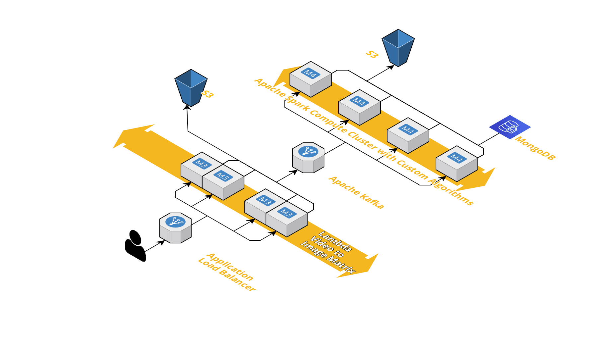
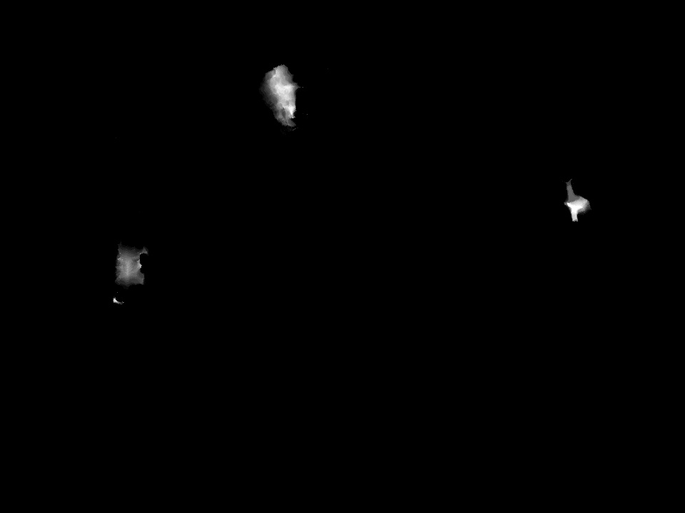
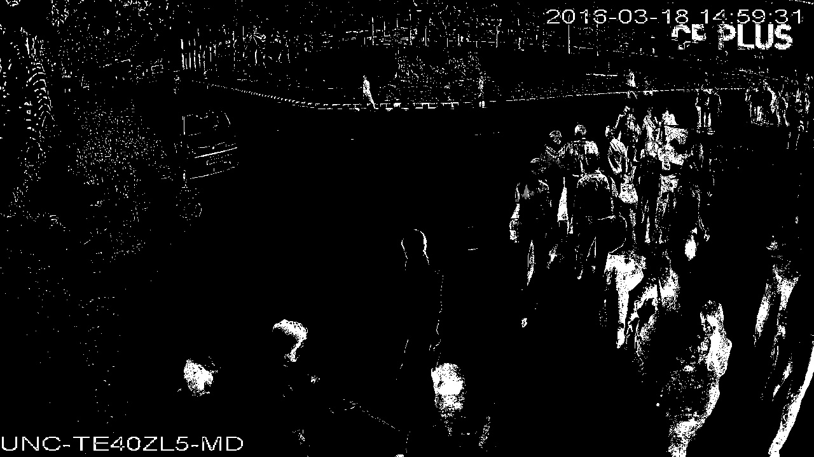

# furnace
A Heatmap Visualizer for Video Feeds written in Python.
- The algorithm is fed with chunks of video frames spanning a period of 1 minute each, onto which an operation can be performed. The system aggregates them over a time period and projects the result onto an RGB heatmap.
- The algorithm can be switched out to perform anything, from motion detection, to gaze detection, to motion vector computations.
- The requirement is that for 60 seconds of video frames provided as input, the algorithm must output 60 activation images. 

## Architecture

- The client first obtains the large videos, breaks them up into 1 minute chunks. These chunks are uploaded straight to the AWS endpoint. Entries are created in the DB for the same.
- The first layer of lambdas accept the videos and convert them into a series of image matrices that are fed into Apache kafka for distributed processing later using a Spark cluster.
- The compute nodes of the spark cluster can decide what operation to perform on the recieved data based on the use case.
- As each second of video is processed, and their activation maps are stored into S3, the nodes also update the corresponding entries in the database.
- When all entries of the each minute is filled, the system computes the hours average. When all entries of the each hour is filled, the system computes the days average. And so on for weeks, months, years consecutively.
- Mostly the uploaded data never changes, so precomputing is not going to be heavy on the system.

## Example activation maps per second

## Interface
- An Angular App on the frontend, enables the user to query the data from any given point in time to any other point in time.
- For a given time period, the backend cleverly uses the aggregated data and merges them using the minimum number of computations required for the time period.
- The user can further get higher resolution heatmaps for smaller inner regions of the video, by clipping the observation area and then recomputing the heatmap. This for example can allow you to view the heatmap accurately on lower populated areas of the store, without the higher crowd areas messing with the heatmap distribution.

## Prerequisites
- Python 3.6
- OpenCV
- Numpy

## Demo
- Run the file demo-frame-by-frame.py or demo-overall.py

## Usage
	- Under development. Currently for presentational purposes only.

